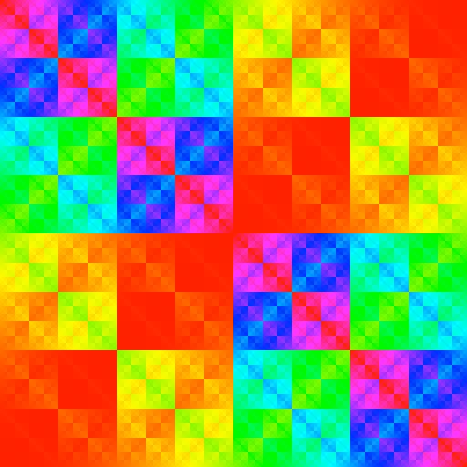

# Neon

Digital cellophane

## What does this do?

It overlays a tint colour on your menu bar.

## Why would I want this?

If you have multiple Macs connected to multiple displays that are right
next to each other, it can be a useful at-a-glance indicator of which
display is connected to which Mac. Or maybe you just like colours.

## What is the icon?

`hue = ((x ^ y) * (y ^ x)) / (width * height)`
